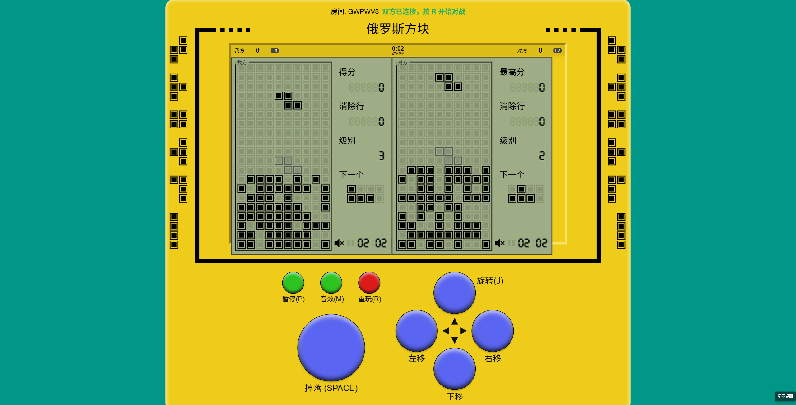
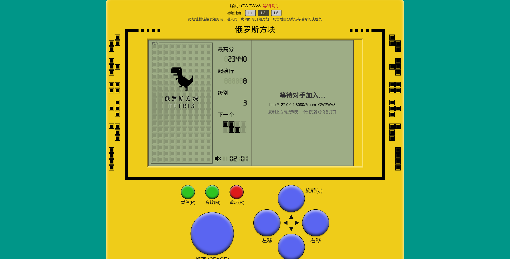
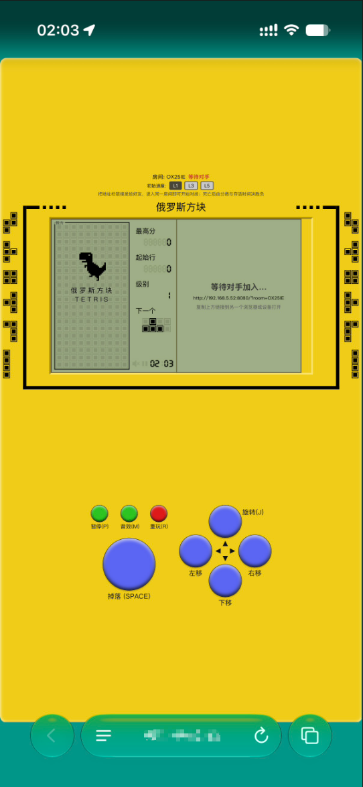
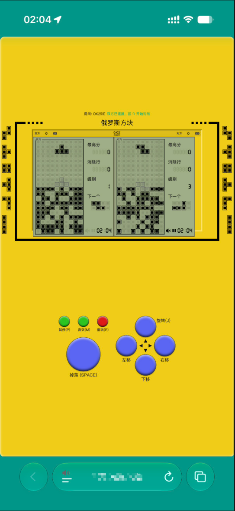

# Tetris Online / 俄罗斯方块在线对战

基于 [chvin/react-tetris](https://github.com/chvin/react-tetris) 二次开发的俄罗斯方块在线对战版。

> 原作者代码保留在 [`original-master`](https://gitee.com/mingtiank/tetris-online/tree/original-master) 分支，以示尊重。

---

## 💬 为什么做这个项目

我从小就喜欢俄罗斯方块，没事就会玩上几局。之前偶然看到 [chvin/react-tetris](https://github.com/chvin/react-tetris)，一下子被它复古又精致的画面、流畅的按键手感吸引住了，断断续续体验了很久。

但玩多了，总会想：**要是能和朋友一起对战就好了**。找了一圈手机上的俄罗斯方块，要么是广告满天飞，要么操作手感不行，真正干净、好看、又能联机对战的几乎没有。于是干脆自己动手，在这个项目基础上加了双人 WebSocket 对战模式，也顺手补上了方块下落阴影，方便预判落点。

> ⚠️ 这是一个 **几小时内做出来的基础版本**，目前只实现了最核心的双人对战，特效、UI、对战玩法、房主控制、房间配置这些都还没来得及打磨。单人模式依然保留，欢迎大家试玩，也欢迎提建议——**我希望它能慢慢长成一款真正好用的俄罗斯方块应用。**

---

## 在线体验

- 🌐 GitHub Pages：**https://mingtTiani.github.io/tetris-online**
- 本地运行：`npm start`，然后访问 `http://127.0.0.1:8080`

> 注意：双人对战需要额外运行 `npm run server` 启动 WebSocket 服务器。

---

## 新增功能

### 双人 WebSocket 实时对战

同一房间内的两名玩家实时同步对战，本地与远端画面分屏显示，并实时对比双方分数、等级与存活时间。



### 房间系统与等待对手

打开页面后会自动分配房间号，将地址栏链接发送给好友，对方进入同一房间后即可开始对战；等待时显示当前房间状态与分享链接。



### 手机端适配

支持手机浏览器访问，触屏按钮与键盘操作并存，手机端同样可以等待对手和进行对战。





### 设置页面

在开始菜单点击 ⚙️ 进入设置，可调整：

- **游戏模式**：单人模式 / 双人模式切换
- **按键绑定**：自定义各个操作的键盘按键
- **游戏参数**：初始速度、初始行数、落地阴影开关
- **音频**：音量、音效开关
- **网络**：双人对战的 WebSocket 服务器地址
- **语言**：中文 / English / 跟随系统

设置会自动保存到 localStorage，刷新后保留。

### 单人 / 双人模式

- **单人模式**（默认）：无需启动服务器，打开即玩，死亡后按 `R` 直接重开。
- **双人模式**：需要运行 `npm run server`，自动生成房间号，将链接发给好友即可对战。

### 其他特性

- **对战计分板**：实时显示双方分数、等级、游戏时间和对战状态。
- **加时赛机制**：一方死亡后，另一方进入加时追分阶段。
- **游戏结果判定**：根据分数与存活时间判定胜负。
- **落地阴影**：方块下落位置预览，便于精准操作。

---

## 技术栈

| 技术 | 说明 |
|------|------|
| [React](https://reactjs.org/) | UI 框架 |
| [Redux](https://redux.js.org/) + [redux-immutable](https://github.com/gajus/redux-immutable) | 状态管理，state 使用 Immutable 对象 |
| [Immutable.js](https://immutable-js.github.io/immutable-js/) | 不可变数据结构，优化深层比较与 `shouldComponentUpdate` |
| [WebSocket](https://developer.mozilla.org/zh-CN/docs/Web/API/WebSocket) / [ws](https://github.com/websockets/ws) | 双人对战实时通信 |
| [Webpack](https://webpack.js.org/) | 构建工具 |
| [Less](https://lesscss.org/) | 样式预处理 |
| [Web Audio API](https://developer.mozilla.org/zh-CN/docs/Web/API/Web_Audio_API) | 音效播放 |

---

## 项目结构

```
.
├── docs/                 # 构建产物（可部署到 GitHub/Gitee Pages）
├── server/               # WebSocket 对战服务器
│   └── websocket.js      # ws 服务器实现
├── src/
│   ├── actions/          # Redux actions
│   ├── components/       # React 组件
│   ├── containers/       # 页面容器
│   ├── control/          # 游戏流程控制
│   ├── network/          # WebSocket 客户端封装
│   ├── reducers/         # Redux reducers
│   │   ├── gameResult/   # 对战结果
│   │   ├── gameTime/     # 游戏时间
│   │   ├── overtime/     # 加时赛
│   │   ├── playerDead/   # 玩家死亡状态
│   │   └── remote/       # 远端玩家数据
│   ├── unit/             # 工具函数与常量
│   └── index.js          # 应用入口
├── img/                  # README 配图
├── package.json
└── README.md
```

---

## 本地开发

### 安装依赖

```bash
npm install
```

### 启动前端

```bash
npm start
```

浏览器会自动打开 `http://127.0.0.1:8080`。

### 启动对战服务器

```bash
npm run server
```

默认 WebSocket 端口为 `3000`，可在 `server/websocket.js` 中修改。

### 打包构建

```bash
npm run build
```

构建产物输出到 `docs/` 目录。

---

## 🗺️ 后续计划（Roadmap）

> 以下功能都是业余时间慢慢做，没有明确排期，最优先打磨 **UI 表现** 和 **对战玩法细节**（比如更直观的比分、状态提示、结算动画等）。目前不打算引入额外后台服务，对战仍基于现有 WebSocket 本地/自建服务器模式，尽量保持原作者“纯 React”的轻量感。

### 第二阶段：对战体验完善

- [x] **再来一局 / 快速重开**：一局结束后无需刷新，直接重开或返回房间。
- [ ] **对战倒计时开局**：双方准备就绪后统一 3-2-1 开始，避免先手优势。
- [ ] **垃圾行攻击（Garbage Lines）**：一次消除多行时给对手底部增加干扰行，经典俄罗斯方块对战机制。
- [ ] **对战结算页优化**：更清晰地展示双方分数、消除行数、存活时间、胜负原因和 MVP 数据。
- [ ] **观战模式**：房间满人后，第三名进入者可以旁观对战（需扩展当前本地服务器能力）。

### 第三阶段：房间与配置

- [x] **房主控制 / 房间参数配置**：通过设置页面调整初始速度、起始行数、加时赛、阴影等。
- [ ] **房间列表 / 快速匹配（远期考虑）**：不依赖第三方后台，仅在当前本地服务器架构可行时再考虑。

### 第四阶段：应用化与体验

- [x] **视觉与基础体验优化**：设置弹窗、滑块开关、自定义下拉框、移动端适配。
- [ ] **音效与震动反馈**：优化当前 Web Audio 音效，手机端加入震动反馈。
- [ ] **键盘与手柄支持**：除键盘外，支持游戏手柄操作。
- [x] **离线单人模式强化**：默认单人模式、设置页面、本地配置持久化。
- [ ] **打包成移动端 App**：使用 Capacitor / Cordova 将网页打包为 iOS / Android 应用。

---

## 操作说明

默认按键如下，也可在设置页面中自定义：

| 按键 | 功能 |
|------|------|
| `A` / `←` | 左移 |
| `D` / `→` | 右移 |
| `S` / `↓` | 缓慢下落 |
| `空格` | 直接坠落 |
| `J` / `↑` | 旋转 |
| `P` | 暂停 |
| `M` | 开关音效 |
| `R` | 开始对战 / 重新开始 |

> 点击开始菜单的 ⚙️ 按钮即可进入设置，修改按键、模式、音量等选项。

---

## 对战玩法

### 单人模式

1. 打开游戏页面后，默认进入单人模式，按 `R` 开始游戏。
2. 死亡后按 `R` 重新开始。

### 双人模式

1. 在设置中切换到双人模式（或带上 `?room=xxx` 参数打开页面）。
2. 页面会自动分配房间号，将地址栏链接发送给好友。
3. 双方都进入后，按 `R` 开始对战。
4. 先堆到顶部的一方失败，进入加时赛；最终由分数和存活时间判定胜负。

---

## 致谢

- 原项目：[chvin/react-tetris](https://github.com/chvin/react-tetris)
- 原作者：[chvin](https://github.com/chvin)

本项目在原作基础上增加了双人联机对战功能，原作代码可在 [`original-master`](https://gitee.com/mingtiank/tetris-online/tree/original-master) 分支查看。

---

## 联系与反馈

如果你有任何建议、想法，或者发现了 Bug，欢迎联系我：

- 📧 邮箱：**mingtinai@outlook.com**
- 💬 微信扫码：


---

## License

遵循原项目 [Apache-2.0](https://github.com/chvin/react-tetris/blob/master/LICENSE) 协议。
